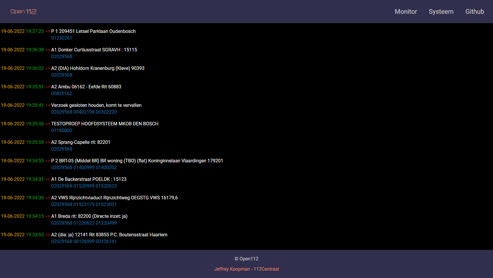
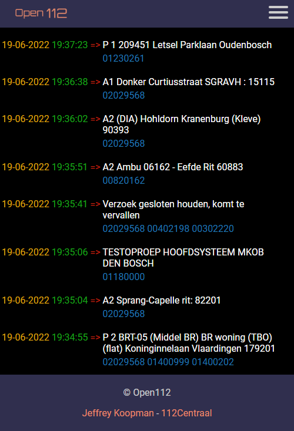
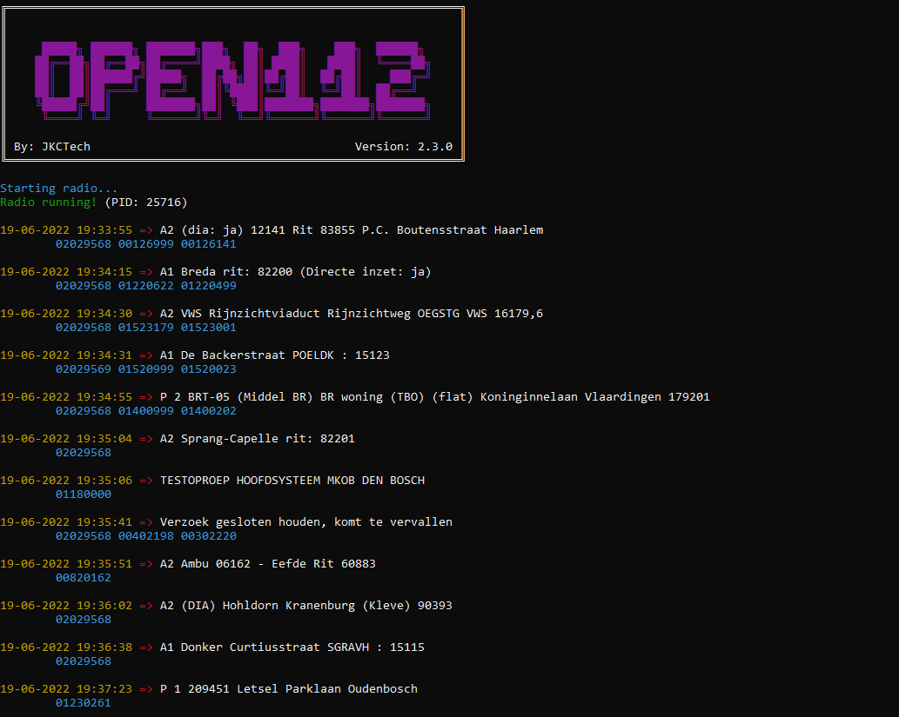

# Open112

Open112 is open source <a href="https://nl.wikipedia.org/wiki/P2000_(netwerk)" target="_blank">P2000</a> receiver software, intended to receive pager notificiations from the Dutch Emergency Services.

This software doubles as feeder software for <a href="https://112centraal.nl" target="_blank">112Centraal</a>.

  

## Prerequisites

 - A device / server to run on with at least 1 free USB port (Windows / Linux)
	- A Raspberry Pi is perfect for this purpose!
 - Some form of compatible RTL-SDR dongle
 - Basic terminal and config editing skills

## Installation

Clone this repository to your device:
```bash
git clone https://github.com/jkctech/Open112
```
*(This way, you can update your feeder by running `git pull`)*

**Now please refer to one of the following installation manuals:**

#### > <a href="/docs/install_linux.md">Linux Installation</a>
#### > <a href="/docs/install_windows.md">Windows Installation</a>

## Features

 - Terminal display
 - (Mobile) Browser support
 - Crash / Soft-lock detection
 - Data feeding to 112Centraal
 - Custom feeding URL's

## Planned Features

 - Capcode resolving
